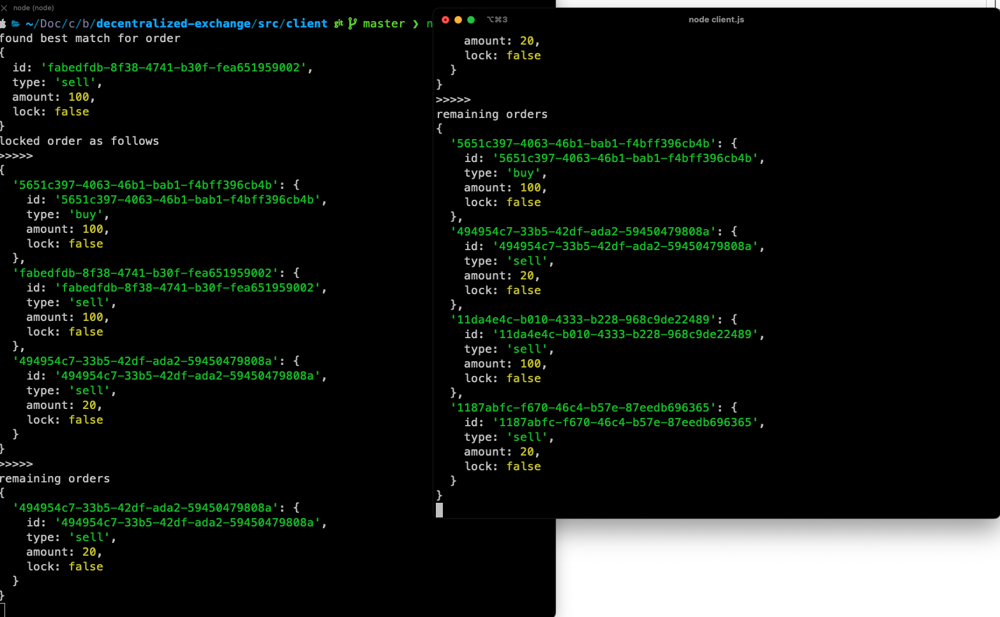

**Installations**

- run `npm i -g grenache-grape` to install grenache globally
- Pull the repo and run `npm install`

**Steps to Run**

- start up grape servers using the command

```
grape --dp 20001 --aph 30001 --bn '127.0.0.1:20002
grape --dp 20002 --aph 40001 --bn '127.0.0.1:20001'
```

**Notes**

- each client has its own scoped data
- add orders and propagate changes
- match best orders
- calculate balances after matching
- propagate new state after matching

**Things to improve**

- more safety e.g check if type provided
- mock data for some of the nodes
- some tests for some of the functions
- re-design, messy choices
- user promisify instead of some callbacks
- more marshalling, or typescript. some errors are easy to miss
- eliminate some redundancy
- handling possible errors
- reliable way of clients to ensure we merge changes
- Some bugs

**Commands to run**

- apart from the grenache set up
- you simply need to go to the client and server folders and run node server.js and node client.js. You can run multiple versions of the clients.

In the image on the right, we start one client with 3 orders, 2 directly matching and cancelling after matching.

On the right, we start another client and we can see the other request persists on the server.


